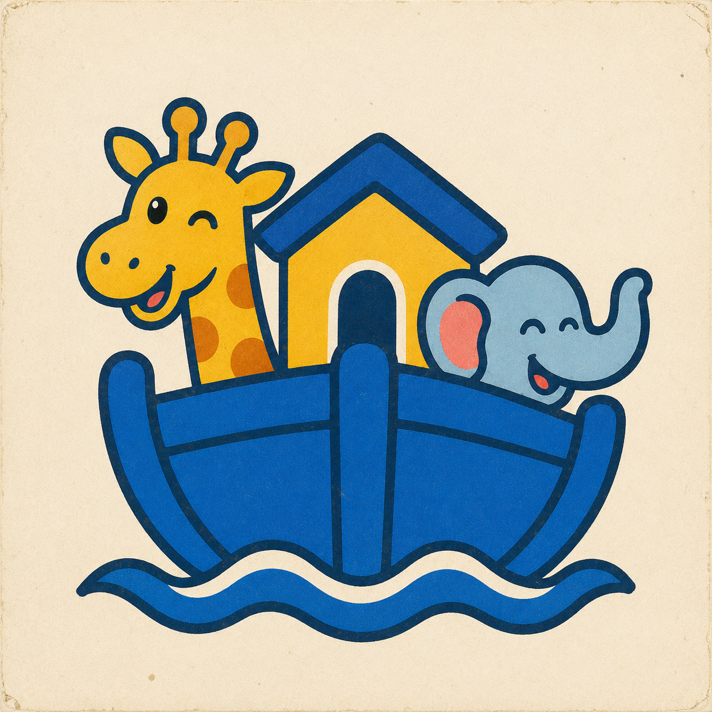

# gdynia

Arc-style keyboard shortcuts for Chrome. Built with [Plasmo](https://docs.plasmo.com) + TypeScript.

## Disclaimer

⌘⇧C and ⌘C collide with "Inspect Element" and "Bookmark". You have to bind it at `chrome://extensions/shortcuts`.

https://github.com/hasparus/gdynia

## Develop

```bash
bun install
bun dev          # watch build → build/chrome-mv3-dev
```

Load the unpacked extension: `chrome://extensions` → enable Developer mode →
**Load unpacked** → select `build/chrome-mv3-dev`.

## Build

```bash
bun run build    # → build/chrome-mv3-prod
bun run package  # → zipped artifact for the Web Store
bun run test:e2e # build + Playwright extension tests
```

## Notes

- On first install, an onboarding tab opens and walks you
  through assigning the shortcuts at `chrome://extensions/shortcuts`. Chrome
  reserves ⌘⇧C and ⌘⇧D, so it won't bind the manifest defaults automatically.
- Copy URL injects into the active tab, so it works on normal pages but not on
  restricted pages (`chrome://`, the New Tab page, the Web Store). The popup's
  "Copy current URL" button works regardless.
- Chrome grants `activeTab` on each keyboard-command invocation, so Gdynia
  needs no broad host permissions.
